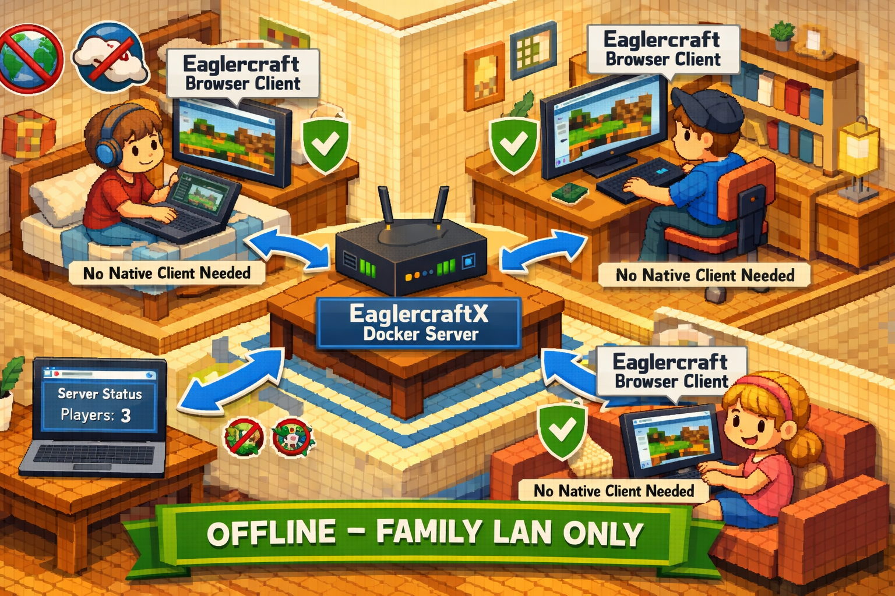

# Eaglercraft 1.12.2 Server - Docker Build Kit



A complete Docker build framework for creating self-contained Eaglercraft 1.12.2 servers that run browser-based Minecraft 1.12.2 without requiring accounts or installations. Perfect for educational purposes and offline family gaming!

> **Also available:** The `main` branch has the [EaglercraftX 1.8.8 version](https://github.com/hackboxguy/eaglercraft-docker/tree/main).

## ✨ Features

- 🎮 **Browser-based Minecraft 1.12.2** - No client installation required
- 🚫 **No accounts needed** - Educational environment with any username
- 🔒 **Completely offline** - No internet dependency after setup
- 🔌 **Single port** - Web client and game server on one port (8081)
- 📦 **Containerized solution** - Everything packaged in Docker
- 💾 **Automatic persistence** - Worlds and logs saved locally in `./data/`
- 🔧 **Zero configuration** - Works out of the box after building
- 🏥 **Health monitoring** - Built-in health checks and status reporting
- ⚡ **Simplified stack** - Java 17, Paper 1.12.2, single process (no proxy needed)

## 📋 Prerequisites

- 4GB+ free RAM (2GB for running, more during build)
- Ports 8081 (game) and 8082 (admin dashboard) available on your machine

### Install Docker (if not already installed)

**Ubuntu / Debian:**
```bash
sudo apt-get update
sudo apt-get install -y docker.io docker-compose docker-buildx git
sudo usermod -aG docker $USER
# Log out and back in for the group change to take effect
```

**Arch Linux:**
```bash
sudo pacman -S docker docker-compose docker-buildx git
sudo systemctl enable --now docker
sudo usermod -aG docker $USER
# Log out and back in for the group change to take effect
```

> **Note:** This README uses `docker compose` (Docker plugin syntax). If you have the older
> standalone version, use `docker-compose` (with hyphen) instead. Both work the same way.

## 🚀 Quick Start

### Step 1: Clone and Build

```bash
git clone -b v1.12.2 https://github.com/hackboxguy/eaglercraft-docker.git
cd eaglercraft-docker
docker build -t eaglercraft-1.12.2-server:local .
```

The build downloads and assembles all server components. It takes **5-15 minutes** depending on
your internet speed. You'll see a lot of output — that's normal. When it's done, you should see:

```
Successfully tagged eaglercraft-1.12.2-server:local
```

> **Build error?** If you see a "legacy builder" error, your Docker needs the BuildKit plugin.
> Install it with `sudo apt-get install docker-buildx-plugin` (Ubuntu/Debian) or
> `sudo pacman -S docker-buildx` (Arch), then run the build command again.

### Step 2: Start the Server

```bash
docker compose up -d
```

This starts two containers — a quick init container (sets up directories) followed by the
game server. The server needs about **60-90 seconds** to fully start. Check the progress with:

```bash
docker compose logs -f eaglercraft
```

Wait until you see this in the logs:

```
Eaglercraft 1.12.2 Server Container
Connect URL:  http://<IP>:8081
```

Press `Ctrl+C` to stop following the logs (the server keeps running in the background).

### Step 3: Open Your Browser and Play

1. Open **Chrome or Firefox** and navigate to `http://localhost:8081`
   (or `http://YOUR_SERVER_IP:8081` from another device on the same network)
2. You should see the **Eaglercraft title screen** — a Minecraft-style menu
3. **Enter any username** (no account needed — type whatever you like)
4. Click **Multiplayer** — the local server is already pre-configured in the list
5. Click the server and **Join** — you're in!

> **Tip:** To find your server's IP for other devices on your network, run: `hostname -I | awk '{print $1}'`

## 📊 Admin Dashboard (Plan Player Analytics)

The server includes [Plan Player Analytics](https://www.playeranalytics.net/) for server monitoring.

**Access the dashboard:** `http://localhost:8082` (or `http://YOUR_SERVER_IP:8082`)

The dashboard provides:
- Real-time server performance (TPS, CPU, RAM)
- Player session history and activity
- Online player tracking

> **Note:** The dashboard starts automatically with Paper. It may take a minute after
> server startup to become available. No login is required on HTTP mode (LAN-only access).

### Server Console Commands

You can manage the server through the Paper console:

```bash
# Attach to the server console
docker attach eaglercraft-1.12.2-server

# Useful commands (type these in the console):
#   list                          - Show online players
#   op PlayerName                 - Give a player admin privileges
#   gamemode creative PlayerName  - Change player game mode
#   difficulty peaceful           - Change world difficulty
#   whitelist add PlayerName      - Add player to whitelist
#   ban PlayerName                - Ban a player
#   say Hello everyone!           - Broadcast a message
#
# EssentialsX commands (players can use these in-game chat):
#   /sethome, /home               - Set and teleport to home
#   /tpa PlayerName               - Request teleport to another player
#   /spawn                        - Teleport to spawn
#   /warp, /setwarp               - Teleport to/create warps (admin)
#
# LuckPerms (permissions):
#   lp user PlayerName group set admin  - Make player an admin
#   lp group default permission set essentials.home true  - Allow /home for all

# Press Ctrl+P then Ctrl+Q to detach from the console (server keeps running)
```

## 📦 What Gets Built

The build process creates a container with:
- **Ubuntu 22.04** base system
- **OpenJDK 17** runtime environment
- **Paper 1.12.2** - High-performance Minecraft server (Paper fork)
- **EaglerXServer v1.0.8** - Eaglercraft WebSocket protocol plugin
- **EaglerWeb** - Serves the web client via HTTP on the same port
- **Eaglercraft 1.12.2 web client** - Browser-based game client

### Included Plugins

| Plugin | Purpose |
|--------|---------|
| **Plan Player Analytics** | Web dashboard for server/player stats (port 8082) |
| **Vault** | Economy and permissions API bridge |
| **LuckPerms** | Permissions management (groups, roles) |
| **EssentialsX** | Homes, warps, teleport, kits, economy, chat formatting |
| **WorldEdit** | Mass block editing tool for admins |
| **WorldGuard** | Region protection to prevent griefing |

## 🏗️ Architecture

```
Browser (port 8081)
    |
    v
Paper 1.12.2 (port 8081)
    |--- HTTP requests --> EaglerWeb plugin --> Eaglercraft 1.12.2 Web Client
    |--- WebSocket     --> EaglerXServer plugin --> Game World
                                                      |
                                                 Game Worlds
                                               (persistent volume)

Admin Browser (port 8082) --> Plan Player Analytics Dashboard (port 8804 internal)
```

The container runs a **single Paper 1.12.2 process** with EaglerXServer handling Eaglercraft
WebSocket connections and EaglerWeb serving the browser client — all on port 8081.

## 🔧 Management Commands

### Basic Operations
```bash
# Build image
docker build -t eaglercraft-1.12.2-server:local .

# Start server
docker compose up -d

# Stop server
docker compose down

# View startup logs
docker compose logs -f

# Restart server
docker compose restart

# Check status
docker compose ps

# Rebuild and restart
docker compose down && docker build -t eaglercraft-1.12.2-server:local . && docker compose up -d
```

### Advanced Monitoring
```bash
# View server log
docker exec eaglercraft-1.12.2-server tail -f /opt/eaglercraft/logs/server.log

# Check container health
docker inspect --format='{{.State.Health.Status}}' eaglercraft-1.12.2-server
```

### Data Management
```bash
# Backup worlds and logs
tar -czf eaglercraft-backup-$(date +%Y%m%d).tar.gz data/

# Backup just worlds
tar -czf worlds-backup-$(date +%Y%m%d).tar.gz data/worlds/

# Restore from backup
tar -xzf eaglercraft-backup-20260228.tar.gz

# View world files
ls -la data/worlds/world/
```

## 🌐 Network Setup

### For Local Gaming (Same Network)
- **Web Client + Game:** `http://192.168.1.XXX:8081`

### For Remote Access
```bash
# Open firewall port (Ubuntu/Debian)
sudo ufw allow 8081/tcp

# Or for specific IP range
sudo ufw allow from 192.168.1.0/24 to any port 8081
```

## 🛡️ Safety Defaults (Recommended for Families)

- Keep this server on your **private home LAN** only
- **Do not expose** port 8081 directly to the public internet
- Anyone with LAN access to the server can join with any username — there is no authentication
- If remote access is needed, use a **VPN** instead of opening firewall ports
- Back up your worlds regularly (see Data Management above)

## 📁 Repository Structure

```
eaglercraft-docker/
├── Dockerfile              # Build instructions for the server
├── docker-compose.yml      # Deployment configuration
├── CLAUDE.md               # Project conventions for Claude Code
├── PLAN.md                 # Version tracking document
├── README.md               # This documentation
├── LICENSE                 # Legal notices
└── data/                   # Auto-created on first run
    ├── worlds/             # Persistent Minecraft worlds
    │   ├── world/
    │   ├── world_nether/
    │   └── world_the_end/
    └── logs/               # Server logs and diagnostics
```

## 🛠️ Troubleshooting

### Build Issues
```bash
# If build fails due to network issues
docker build --no-cache -t eaglercraft-1.12.2-server:local .

# Check build logs for specific errors
docker build -t eaglercraft-1.12.2-server:local . 2>&1 | tee build.log

# Clean build (removes all cached layers)
docker system prune -a
docker build -t eaglercraft-1.12.2-server:local .
```

### Server Won't Start
```bash
# Check detailed logs
docker compose logs eaglercraft-init
docker compose logs eaglercraft

# Verify image was built correctly
docker images | grep eaglercraft-1.12.2-server
```

### Can't Connect from Browser
1. **Check port is listening on host:** `ss -tlnp | grep 8081`
2. **Test from the server itself:** `curl -I http://localhost:8081`
3. **Try different browser** (Chrome/Firefox recommended)
4. **Disable browser extensions** that might block WebSockets
5. **Check firewall settings** (port 8081 must be open)
6. **Use server IP instead of localhost** when connecting from other devices

### Can't Join Game
1. **Verify the server is in the multiplayer list** - it should be pre-configured
2. **Check browser console** (F12 > Console) for WebSocket errors
3. **Verify port 8081 is accessible:** `curl -I http://YOUR_SERVER_IP:8081`
4. **Check server logs:** `docker exec eaglercraft-1.12.2-server cat /opt/eaglercraft/logs/server.log`
5. **Try different browsers** or clear browser cache

### Performance Issues
```bash
# Check resource usage
docker stats eaglercraft-1.12.2-server

# Adjust memory limits in docker-compose.yml
services:
  eaglercraft:
    deploy:
      resources:
        limits:
          memory: 2G
        reservations:
          memory: 1G
```

## 🔧 System Requirements

### For Building:
- **CPU:** 2+ cores recommended
- **RAM:** 4GB+ available during build
- **Storage:** 5GB+ free space
- **Network:** Stable internet for downloading components

### For Running:
- **CPU:** 1+ cores (2+ recommended for multiple players)
- **RAM:** 2GB+ available (4GB+ recommended)
- **Storage:** 2GB+ for built image, additional space for worlds
- **Network:** Port 8081 accessible

## 📜 Credits

This Docker build framework utilizes:
- **[Eaglercraft 1.12.2](https://eaglercraft.com/)** - Browser-based Minecraft 1.12.2 port
- **[EaglerXServer](https://github.com/lax1dude/eaglerxserver)** - Unified Eaglercraft server plugin
- **[Paper 1.12.2](https://papermc.io/)** - High-performance Minecraft server

## ⚖️ Legal Notice

This project is for **educational and research purposes only**. It builds upon open-source Eaglercraft implementations. Users are responsible for:
- Ensuring compliance with applicable laws
- Respecting intellectual property rights
- Using only for educational/research purposes
- Not distributing built images commercially

## 🔄 Updates and Maintenance

```bash
# Update to latest version
git pull origin v1.12.2

# Rebuild with updates
docker compose down
docker build --no-cache -t eaglercraft-1.12.2-server:local .
docker compose up -d

# Clean old images (optional)
docker image prune -f
```

---

**🎮 Happy Building! Enjoy Minecraft 1.12.2 in your browser! ⛏️🐳**
